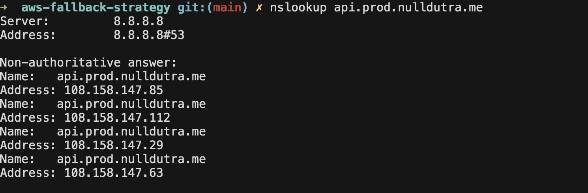
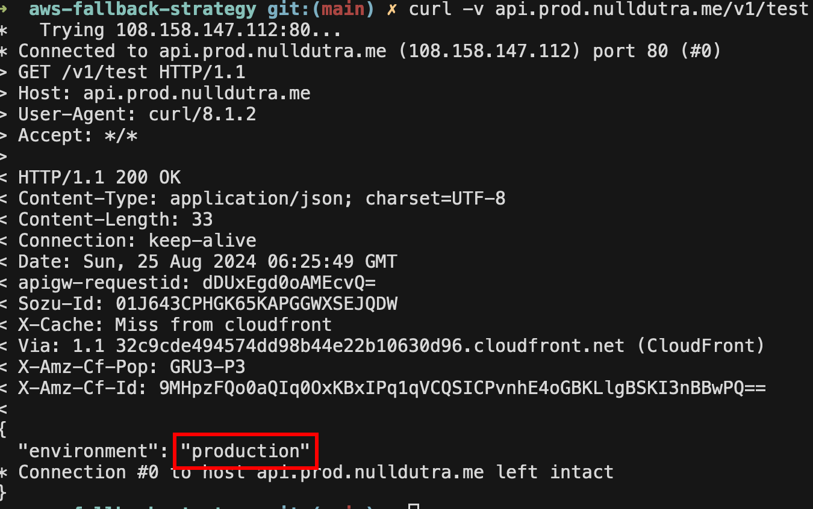
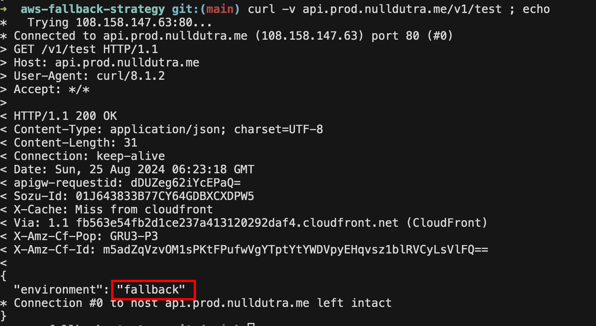

## AWS Fallback Strategy

This is a proof of concept (PoC) for establishing a fallback environment across two AWS regions (us-east-1 and us-east-2). 
The PoC leverages DNS concepts and a single endpoint to manage traffic between these regions.

## Terraform provider

The first step is create the `provider.tf` with the regions. The API Gateway and ACM will be created in
both regions.

```hcl
provider "aws" {
  region = "us-east-1"
}

provider "aws" {
  region = "us-east-2"
  alias  = "fallback"
}
```

## API Gateway

The API Gateway module was called twice in the main.tf. One API Gateway uses the provider for us-east-1 and the other for us-east-2.

```hcl
module "api_gateway" {
  source = "./modules/api-gateway"

  name            = "api-http"
  certificate_arn = module.acm.acm_certificate_arn
  ...
}

module "api_gateway_fallback" {
  source = "./modules/api-gateway"

  providers = {
    aws = aws.fallback
  }

  name            = "api-http-fallback"
  certificate_arn = module.acm_fallback.acm_certificate_arn
  ...
}
```

## ACM

Just like the API Gateway, ACM was also called twice in the main.tf. We need to deploy ACM with the same domain in both regions.
In this case, I choose to use the public module. Yes, I'm very lazy, sorry :(.

```hcl
module "acm" {
  source  = "terraform-aws-modules/acm/aws"
  version = "~> 5.0"

  domain_name               = local.dns_zone_name
  subject_alternative_names = ["*.${local.dns_zone_name}"]
  zone_id                   = module.route53_zone.zone_id
  validation_method         = "DNS"
  wait_for_validation       = true
}

module "acm_fallback" {
  source  = "terraform-aws-modules/acm/aws"
  version = "~> 5.0"

  providers = {
    aws = aws.fallback
  }

  domain_name               = local.dns_zone_name
  subject_alternative_names = ["*.${local.dns_zone_name}"]
  zone_id                   = module.route53_zone.zone_id
  validation_method         = "DNS"
  wait_for_validation       = true
}
```

## CloudFront

In cloudfront, two origins were created, one for the production environment and another for the fallback environment.
You can control traffic change via the `target_origin_id` entry, switching between production and fallback origins.

```hcl
module "cloudfront" {
  source = "./modules/cloudfront"

  origins = {
    prod = {
      domain_name = replace(module.api_gateway.api_endpoint, "https://", "")
      origin_id   = "prod"
    },
    fallback = {
      domain_name = replace(module.api_gateway_fallback.api_endpoint, "https://", "")
      origin_id   = "fallback"
    }
  }

  target_origin_id = "prod"
  ...
}
```

<hr>

## Testing

I create a API Mock with two endpoints. The origin prod return `{ "environment": "production" }` and the fallback return 
`{ "environment": "fallback" }`.

CloudFront IP's



Request to production origin



Change traffic to fallback



Note that the DNS entry hasn't changed.
